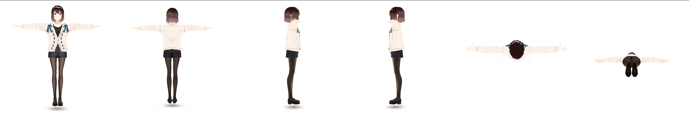

# VRM to Vector

## How it works

### 1. `.vrm` file convert to `.glb`

### 2. Create cubemap images with a `.glb` file by using `puppeteer`

> [How to Use in Puppeteer WSL](https://pptr.dev/troubleshooting#running-puppeteer-on-wsl-windows-subsystem-for-linux)

#### Sample Cubemap Images (6 images)


: front, back, right, left, top, bottom

### 3. Save the cube map images in the vector database using the weaviate API

### 4. Similar Query

## Usage

### 1. Make test images with `puppeteer` and `model-viewer`

```bash
./shot.sh
```

### 2. Similar Search

```bash
node similar.js
```

## Features

- [x] `.vrm` file convert to `.glb`
- [x] Create cubemap images with a `.glb` file by using `puppeteer`
- [x] Save the cube map images in the vector database using the weaviate API
- [x] Similar Search Query
